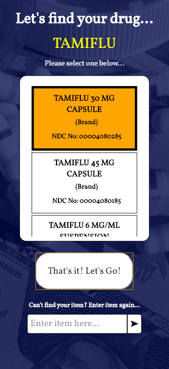
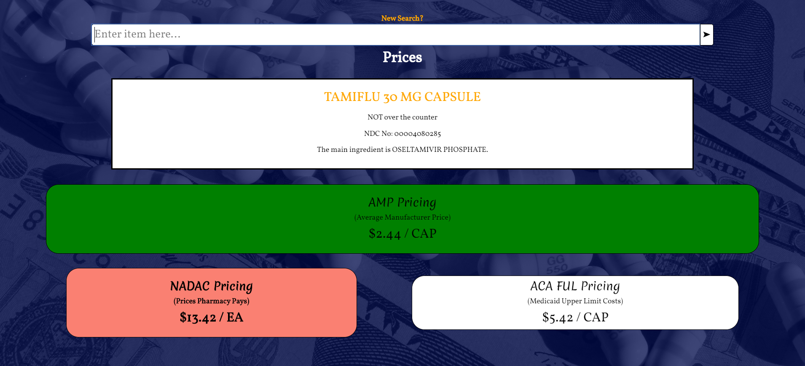
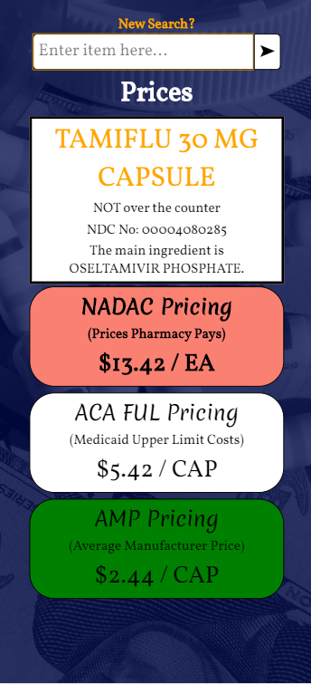
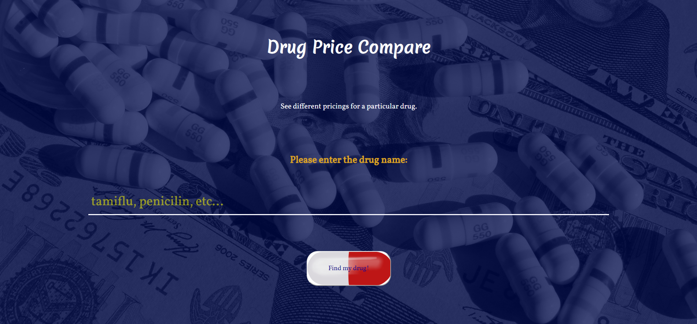
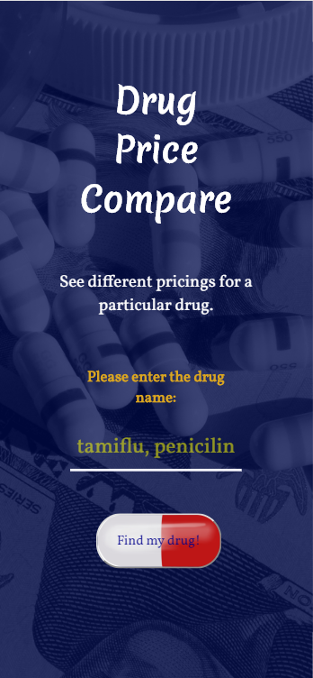

# Drug-Price-Compare
This app lets you see and compare the different pricings for a drug.  The drug pricings are from government set standards, surveys, as well as data.  

# Live App Link:  
https://lsunny5.github.io/Drug-Price-Compare/

## Technologies Used:  HTML/CSS/JavaScript/jQuery

## Motivation:  
     My family and I have always wondered how much the pharmacy pays for the drug as well as what the rates the government had set for each.  Wanted to compare how much I pay (with insurance) to the standard.  

## Summary: 
The Drug Price Compare app will show users the monthly prices for various pharmacy drugs.  The ACA FUL (Affordable Care Act Federal Upper Limits) data is a list created and maintained by the government for use by the State Medicaid Programs.  This information aids in establishing the reimbursement for drugs covered under Medicaid and is used to determine the upper limit for reimbursement for generic and other drugs. The NADAC (National Average Drug Acquisition Cost) prices for brand and generic medications are based on surveys of pharmacies.  It is more representative of the actual acquisition cost(1).  AMP prices are discounted, federally defined prices the manufacturer charges to wholesalers or pharmacies who purchase directly from the manufacturer(2).  The app will primarily find the drugs on the NADAC database and compare the prices with the FUL and AMP prices.  The drugs are identified using the NDC number.  The user can then see the same drug with the various prices.  

1 “Avoiding the Pitfalls of Pharmacy Pricing.”  Johnson, Luke, Mueller, Richard, Tanner, Robert.  https://www.npaonline.org/sites/default/files/PDFs/Avoiding%20the%20Pitfalls%20of%20Pharmacy%20Pricing.pdf 
2 “Understanding Drug Pricing.”  Mattingly, Joey.  US Pharmacist.   2012;37(6)(Generic Drug Review suppl):40-45. https://www.npaonline.org/sites/default/files/PDFs/Avoiding%20the%20Pitfalls%20of%20Pharmacy%20Pricing.pdf 

## Screenshots:  

